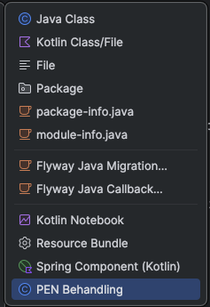
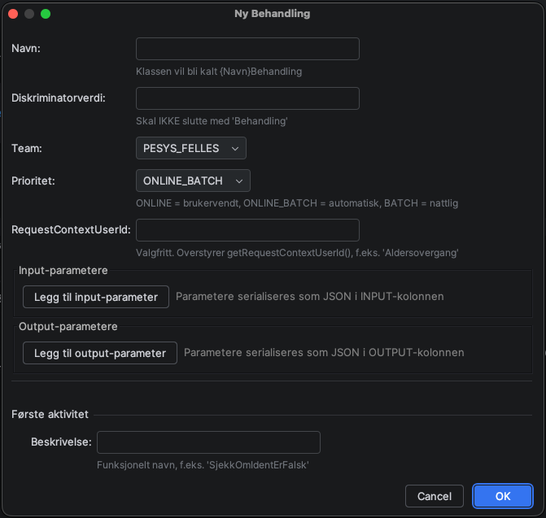
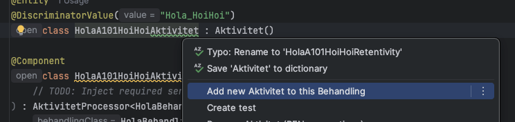
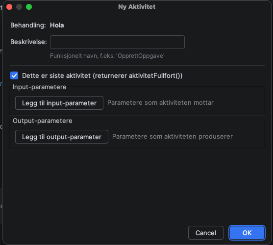

# PEN Behandling IntelliJ Plugin

[](https://github.com/navikt/pen-behandling-intellij-plugin/actions/workflows/build.yml)

IntelliJ-plugin som gjør det enklere å opprette nye behandlinger og aktiviteter i PEN's behandlingsløsning.

## Hvordan ta i bruk

1. Last ned siste versjon av plugin-ZIP fra [Releases](https://github.com/navikt/pen-behandling-intellij-plugin/releases)
2. I IntelliJ: **Settings → Plugins → ⚙️ → Install Plugin from Disk...**
3. Velg den nedlastede ZIP-filen
4. Restart IntelliJ

## Funksjoner

### Ny Behandling (New → PEN Behandling)

Oppretter en komplett behandling med:
- `{Navn}Behandling.kt` — Behandlingsklassen med riktige annotasjoner (`@Entity`, `@DiscriminatorValue`, `@ForvalgtAnsvarligTeam`)
- `A{nr}_{Beskrivelse}.kt` — Initiell aktivitet med `Aktivitet`-entity og `AktivitetProcessor`



Dialogen lar deg velge:
- **Navn** — Navnet på behandlingen (uten "Behandling"-suffiks)
- **Team** — Ansvarlig team (`PESYS_FELLES`, `PESYS_ALDER`, `PESYS_UFORE`)
- **Prioritet** — `ONLINE`, `ONLINE_BATCH` eller `BATCH`
- **Input-parametere** — Parametre som serialiseres til JSON i `INPUT`-kolonnen
- **Output-parametere** — Parametre som serialiseres til JSON i `OUTPUT`-kolonnen
- **RequestContextUserId** — Valgfri overstyring av `getRequestContextUserId()`
- **Initiell aktivitet** — Beskrivelse for første aktivitet



### Ny Aktivitet (Alt+Enter i en Behandling- eller Aktivitet-fil)

Legg til en ny aktivitet direkte fra koden med **Alt+Enter** → *"Add new Aktivitet to this Behandling"*.

- **Fra en `*Behandling.kt`-fil**: Ny aktivitet legges til etter den høyeste eksisterende
- **Fra en `A###_*.kt`-fil**: Ny aktivitet settes inn rett etter den nåværende





Nummereringen håndteres automatisk. Hvis du setter inn en aktivitet midt i flyten, renummereres alle etterfølgende aktiviteter automatisk (filnavn og klassenavn oppdateres i alle filer i mappen).

### Gi nytt navn til Aktivitet (Alt+Enter i en Aktivitet-fil)

**Alt+Enter** → *"Rename Aktivitet (PEN conventions)"* oppdaterer:
- Filnavn (`A101_GammeltNavn.kt` → `A101_NyttNavn.kt`)
- Klassenavn (entity og processor)
- Diskriminatorverdi
- Alle referanser i filer i samme mappe

### Legg til input/output-parameter (Alt+Enter)

I en eksisterende Behandling- eller Aktivitet-fil: **Alt+Enter** → *"Legg til input-parameter"* eller *"Legg til output-parameter"*.

- Legger til felt i data class (`Parametere`/`Input`/`Output`)
- Oppretter getter-property
- Oppdaterer konstruktør og `Json.encodeToString`-kall (input)
- Oppdaterer `setOutput()`-signatur og `Output()`-kall (Aktivitet output)
- Dersom det ikke finnes input/output fra før, opprettes hele blokken med `@Lob`, `@Column`, data class osv.

### Legg til getRequestContextUserId (Alt+Enter)

I en Behandling-fil uten eksisterende override: **Alt+Enter** → *"Legg til getRequestContextUserId()"*.

Setter inn `override fun getRequestContextUserId(): String = "..."` med angitt verdi.

### Inspeksjoner

Pluginen har tre konsoliderte inspeksjoner som sjekker at konvensjonene i dokumentasjon er korrekt. Dennne skal være i henhold til dokumentasjon for Behandlingsløsningen: https://pensjon-dokumentasjon.ansatt.dev.nav.no/pen/Behandlingsloesningen/Behandlingslosningen.html 

#### Behandling-inspeksjon
| Sjekk | Alvorlighet |
|---|---|
| Manglende `@Entity` | ERROR |
| Manglende `@DiscriminatorValue` | ERROR |
| `@DiscriminatorValue` matcher ikke klassenavn-konvensjonen | WARNING |
| Manglende `@ForvalgtAnsvarligTeam` | WARNING |

#### Aktivitet-inspeksjon
| Sjekk | Alvorlighet |
|---|---|
| Manglende `@Entity` | ERROR |
| Manglende `@DiscriminatorValue` | ERROR |
| `@DiscriminatorValue` matcher ikke konvensjonen (`{Behandling}_{Beskrivelse}`) | WARNING |
| Klassenavn slutter ikke med "Aktivitet" | WARNING |
| Ingen `AktivitetProcessor` i samme fil | WARNING |

#### Processor-inspeksjon
| Sjekk | Alvorlighet |
|---|---|
| Manglende `@Component` | WARNING |
| Refererer feil `Behandling`-type (matcher ikke mappen) | WARNING |
| Refererer `Aktivitet`-type som ikke finnes i samme fil | WARNING |

## Bygging (for utvikling)

```bash
./gradlew buildPlugin
```

Plugin-filen havner i `build/distributions/`.

## Bruk

1. **Ny behandling**: Høyreklikk på en mappe → **New → PEN Behandling** → fyll inn skjemaet
2. **Ny aktivitet**: Åpne en behandlings- eller aktivitetsfil → **Alt+Enter** → *"Add new Aktivitet to this Behandling"*
3. **Gi nytt navn**: Åpne en aktivitetsfil → **Alt+Enter** → *"Rename Aktivitet (PEN conventions)"*
4. **Legg til input/output**: Åpne en behandlings- eller aktivitetsfil → **Alt+Enter** → *"Legg til input-parameter"* / *"Legg til output-parameter"*
5. **Legg til getRequestContextUserId**: Åpne en behandlingsfil → **Alt+Enter** → *"Legg til getRequestContextUserId()"*
6. **Inspeksjoner**: Aktiveres automatisk i alle Kotlin-filer med Behandling/Aktivitet/Processor-klasser
